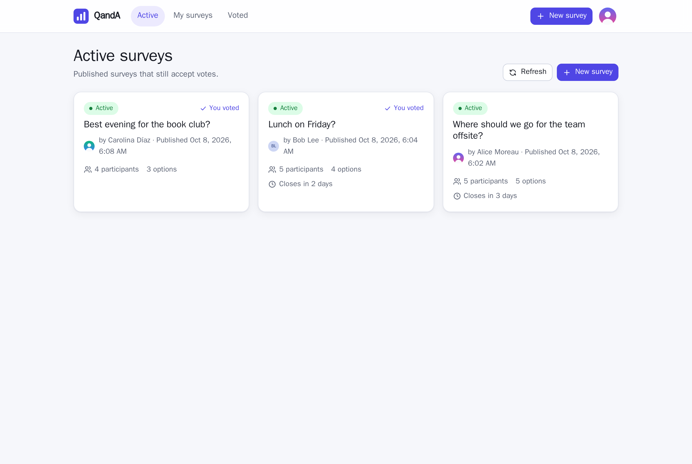
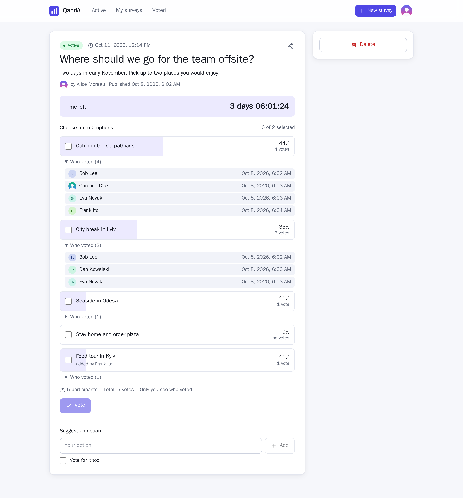
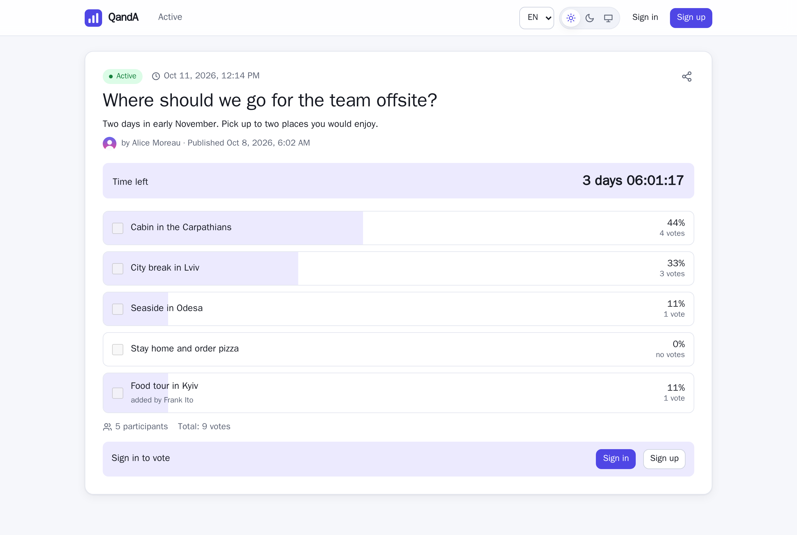
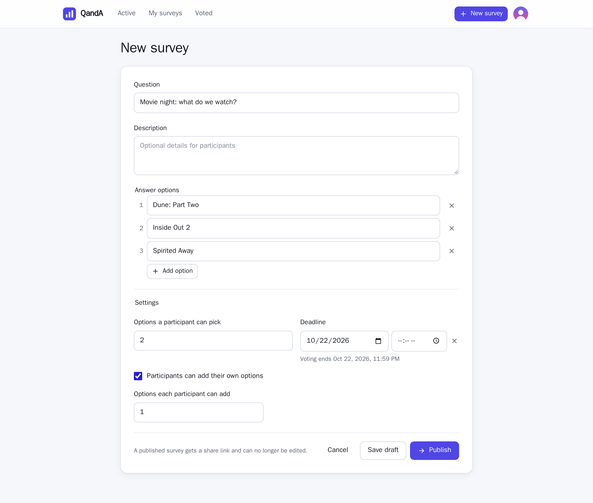
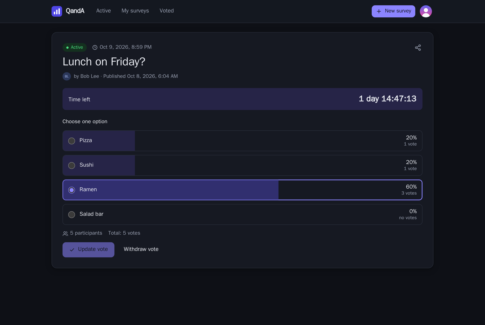
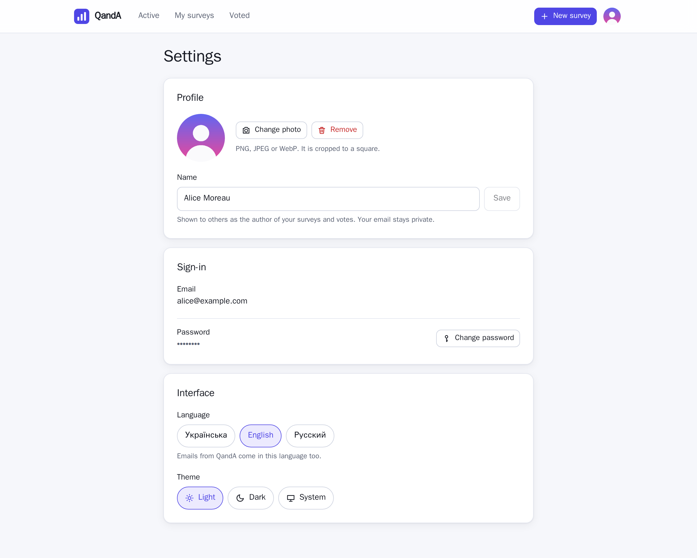
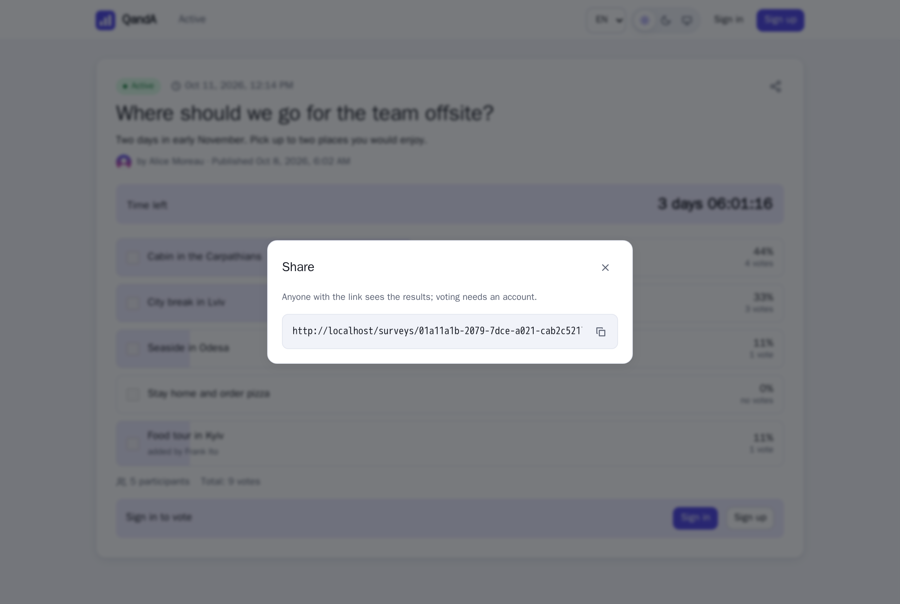
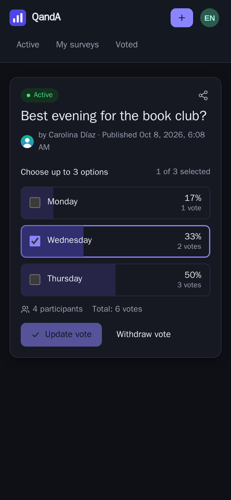

# QandA

Quick polls for friends and teams. Ask a question, give a few answer options, share the link, watch the votes come in.

The interface is available in Ukrainian, English and Russian, with light, dark and system themes.



## Screenshots

| | |
|---|---|
| <br>**The author's view:** countdown, results, who voted for what | <br>**Shared link, as a guest:** results are public, voting needs an account |
| <br>**New survey:** options, vote limit, deadline, participant options | <br>**Dark theme:** a participant who already voted |
| <br>**Settings:** photo, name, password, language, theme | <br>**Sharing:** the link with a copy button |

<p align="center"><br><b>On a phone</b></p>

## Features

- **Surveys.** A question with an optional description and 2–30 answer options. Save it as a private draft and edit it, or publish it right away. Published surveys can no longer be edited, so nobody's vote changes meaning.
- **Sharing.** Every published survey has a link. Anyone who opens it sees the question and the current results. Voting needs an account; after signing in or signing up, the visitor lands back on the same survey.
- **Voting rules set by the author:**
  - how many options a participant may pick (one by default);
  - whether participants may add their own options, and how many each;
  - an optional deadline: a date, or a date and time. A date alone means the end of that day. A live countdown shows the time left, and voting closes the moment it runs out.
- **Changing your mind.** Until the deadline, a participant can change or withdraw their vote. A new option can be added and voted for in one step.
- **Results.** Everyone sees the counts and percentages. Only the author sees who voted for what, and when.
- **Lists.** Active surveys, your own surveys (filter: drafts, active, closed) and the surveys you voted in.
- **Accounts.** Sign up with an email, a display name and a password. The display name and an optional profile photo are what other people see; the email stays private. In the settings you can change the name, photo, password, language and theme.
- **Email (optional).** With an SMTP server configured, new accounts confirm their address before voting, forgotten passwords can be reset by email, and password changes are notified. Without one, everything else works the same: no confirmation is needed and password reset is hidden.

## Run a released version

Releases publish ready-made Docker images for `linux/amd64` and `linux/arm64` (Raspberry Pi 4/5 included). You only need Docker with Compose.

1. Download `docker-compose.yml` (and, optionally, `.env.example`) from the assets of the [latest release](https://github.com/sanioooook/QandA-Project/releases/latest) into an empty folder.
2. Optionally copy `.env.example` to `.env` and set what you need: at least `POSTGRES_PASSWORD` if the machine is reachable by others, and `PUBLIC_URL` if users open the app at an address other than `http://localhost:8080`.
3. Start it:

   ```bash
   docker compose up -d
   ```

4. Open http://localhost:8080 (or `WEB_PORT`). The database schema is created on the first start.

Update to a newer release by replacing `docker-compose.yml` with the new one and running `docker compose up -d` again; data lives in Docker volumes and is kept. Stop with `docker compose down` (add `-v` only if you want to delete all data).

## Configuration

All settings are environment variables, read from `.env` next to the compose file. Everything is optional.

| Variable | Default | Meaning |
|---|---|---|
| `WEB_PORT` | `8080` | Port the app is served on |
| `PUBLIC_URL` | `http://localhost:8080` | Address users open; used for links in emails |
| `POSTGRES_PASSWORD` | `qanda` | Database password (the database is not exposed outside Docker) |
| `EMAIL_SMTP_HOST` | empty | SMTP server. Empty turns email off |
| `EMAIL_SMTP_PORT` | `587` | SMTP port |
| `EMAIL_SMTP_USERNAME`, `EMAIL_SMTP_PASSWORD` | empty | SMTP credentials, if the server needs them |
| `EMAIL_SMTP_SECURITY` | `Auto` | `None`, `StartTls`, `SslOnConnect` or `Auto` |
| `EMAIL_FROM` | `QandA <noreply@qanda.local>` | Sender of the emails |
| `EMAIL_REQUIRE_CONFIRMATION` | `true` | With email on, require a confirmed address to vote and create surveys |

To try email without a real mail server, start [Mailpit](https://mailpit.axllent.org), which catches every email and shows it at http://localhost:8025. Put this into `.env`:

```
COMPOSE_PROFILES=mail
EMAIL_SMTP_HOST=mailpit
EMAIL_SMTP_PORT=1025
EMAIL_SMTP_SECURITY=None
```

## Development

Everything runs in containers; neither Node nor the .NET SDK is needed on the host. `node_modules` lives in a Docker volume.

Build and run the whole stack from the sources (same address, http://localhost:8080):

```bash
docker compose up -d --build
```

Frontend with hot reload on http://localhost:5173, against the API from the stack above:

```bash
docker compose --profile dev up web-dev
```

### Tests

Backend: unit tests of the pure rules plus integration tests that drive the real API over HTTP against a throw-away PostgreSQL database per test class.

```bash
docker compose --profile test run --rm --build api-tests
```

Frontend: type check, unit and component tests, and app-level integration tests that run the whole app against an in-memory API.

```bash
docker compose --profile test run --rm --build web-tests
```

CI runs both suites in parallel on every push.

### Releasing

Push a version tag. CI runs the tests, then the images are built for amd64 and arm64, pushed to `ghcr.io/sanioooook/qanda-api` and `qanda-web`, and a GitHub release is created with a `docker-compose.yml` pinned to that version.

```bash
git tag v2.0.0
```

```bash
git push origin v2.0.0
```

New container packages on GitHub may start out private; if the images cannot be pulled without logging in, make both packages public in the package settings on GitHub.

## Tech stack

- **API** (`Backend/`): .NET 10, ASP.NET Core, EF Core 10 with PostgreSQL 16, cookie authentication with PBKDF2 password hashes, MailKit for SMTP.
- **Web** (`Frontend/`): Vue 3, Vite, TypeScript, Pinia, vue-router, vue-i18n. Plain CSS with design tokens, no UI framework.
- **Tests**: xUnit v3, Vitest, Vue Test Utils, Testing Library.
- **Delivery**: Docker Compose; nginx serves the app and proxies `/api`, so the auth cookie stays first-party.

## History

QandA started in 2021 as a two-week learning project: ASP.NET Core 3.1 with Dapper and SQL Server, and Vue 2. In 2026 it was rewritten on the current stack with proper authentication, the full feature set above, tests and container-based delivery.
